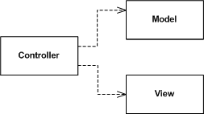

# WIP

structured/titled a bit like https://react.christmas/2017/3

All this to answer the question of: "How is this snapshot of an app represented in *code*?"

# App = UI(State)
In general, an app is some combination of **state**, **user interface**, and **events**. These are the basis of all MV* architectures. The architectures just differ in scope and access.

Said another way: essentially all falls in to presentation (UI), state (often from data), and events/communication to make it dynamic.

# Model confusion
Model *object* vs model *domain*. Object is a simple value type. Domain is more complicated, contains logic for updating, etc.

Model Object -> Dead

Model Domain -> Living

Model *domain* not the same as model *objects*. This is why some are confused about dumb vs. not. ViewModel can be a value type or it can be a smart type. Views can be passive or smart. Domains require more than just value types, they also need wiring/events.

This same confusion can be seen with ViewModel. Some treat a ViewModel as a dead object that is just a  transform of the model domain for a view's presentation (also called View Data). Other's talk about it as a living thing that syncs with the UI (often via binding)

Good analogy is movie frames. An individual one is dead. Rapidly showing one after the other makes it live though.

"VC keeps latest frame. When model updates, calculate new frame."

This move frame analogy works well with React Components, too. React does the heavy lifting with virtual dom to make this more performant.

[Model–view–viewmodel \- Wikipedia](https://en.wikipedia.org/wiki/Model%E2%80%93view%E2%80%93viewmodel)
> Model refers either to a domain model, which represents real state content (an object-oriented approach), or to the data access layer, which represents content (a data-centric approach).[citation needed]

## What is State?
What is **state**? Why not call it **data**?

State considerations:
- May be derived from data (from remote, db, plist, etc)
- Local state of an interface (e.g. whether an accordian is collapsed or expanded) vs widget state vs app state. Point being that scope is relevant to what state is needed for a presentation.
- Temporal vs Persisted
- Content (produced or fetched/consumed) vs app-level settings
- Model objects represent state in an application

### What is Data?
Data is a bag of bits. May be represented as json, csv, plist, xml, etc. We often call content *data* when they come from a server or database, and may continue to refer to it as data within the app, but this is not a good way to think of it. Once it is loaded into the app, it has become *state*. If, for example, we are building a news feed of tweets, instead of calling the tweets "data", we may be better served by calling them "content" or something more representative that it isn't state that necessarily controls the presentation of our app.

Why not call it "data"? Data breaks down when you think about user settings, for example. Or the cache.

"App state" of called what we mean by transient state.

Data = persisted state and/or content

### Content creation example
In a not taking app, when a user is creating a note, all of that note's data is represented as state. Upon save, if it is written to disk, that state will be converted to data. The state will likely still around in memory if the app shows a list of notes, for example. When the app is closed, ram will be released and state will be lost.

Upon app re-starting, app reads files from disk and converts the data back to state.

### State Containers
May also be called Model Controllers.

A state container (store, vm) holds a single state property and can broadcast when it changes.

### A single view's state
Combination of local state and app state. e.g. some view that displays a Person accordian in a collapsed state. The Person comes from app state. The collapsed state is local and should not be used outside of this view.

Super/core/app state. Not sure what to call it.

### Finite State Machine-able
!!! State should always be represented with a FSM. Maybe this points out a different difference between state and data?

# Events
Events are essentially just commands and communication. Some have specific targets, others are just broadcasted.

## User events vs app/system events
User events => Actions

App/system events => Operations
- scheduled w/ dependencies in a queue

## Types of events
- Pull
- Observe (and react)
  - KVO
  - Property Observation
- Bind
- Callback/closures
- Delegate
- Notifications (local + remote)
- RXSwift/ReactiveCocoa?

# User Interface
## Passive Views vs Views
Kind of the corrollary to Model Objects, but on the other side. Passive view is stateless, and something else will interact with it to make updates. It will not update itself.

[Passive View](https://www.martinfowler.com/eaaDev/PassiveScreen.html)
> UI is split between a view that handles display and a controller that responds to user gestures. The significant change with Passive View is that the view is made completely passive and is no longer responsible for updating itself from the model. As a result all of the view logic is in the controller.

Otherwise, the view will update itself when model changes (as is the traditionaly MVC).

Or a View may be bound to the (view)model

## ViewModels
ViewModel's single responsiblity is view logic.

# The Router
Router is handler of termporal state?
- scenes, view options, etc
- FSM

Router is the entry way to a user interface of your app. It may be passed explicit args (think: urls). Ther are also implicit args in context like device/screen types. It is a way to inform your app what is desired/requested.

Coordinator is router + DI. Responsible for assembly and view-to-view presentation.

Root component is Router, with props of "path" and "args"

# Testing
Easiest is **data in**, **data out** testing.

`XCAssert(action == expected)`

View: UI Testing (slow)

ViewModel: DOmainState -> ViewState transforms. Mock interactions (e.g. w/ stores)

Store: Test queries + commands via in vs out testing. Also test interactions (e.g. persistence)

## Separate by import style?
Foundation/CoreData in Model -> Unit Test

Foundation in ViewModel -> Unit Test

UIKit in View -> UI Test