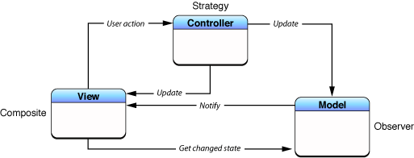
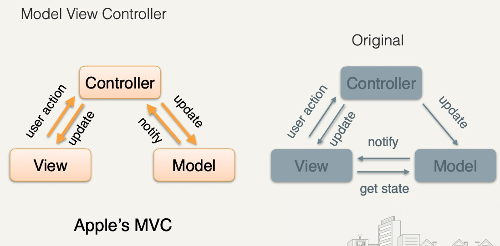

# Think through Model, View, Controller, Model-Controller, View-Controller, View-Model

"If we have ViewControllers responsible for the View, then we can have ModelControllers responsible for the Model" - his example was NS/UIDocument reading/writing to database and updating observers.

And variants like MVVM

Apple has many types of controllers: Mediating Controller, Coordinating Controller, Model Controller, View Controller, Container View Controller. mediating controller mediates the flow of data between view objects and model objects. Coordinating controller's role in an application is to oversee--or coordinate--the functioning of the entire application or of part of the application.

Massive View Controller because ViewController combines View and Controller responsibilities, and model is often really small/light. So everything ends up in ViewController.

Not everything wraps up into a M, V, nor C. E.g. service layers: networking, database access, tracking, etc.

MVC doesn't structure your whole application, only the user-facing portion.

https://youtu.be/A1vzcxR-Ss0?t=69 and for slides: http://khd2.de/talks/MVC-Is-Not-Your-Problem/MVC_Is_Not_Your_Problem.pdf

Also read up on Apple's official doc on all this: https://developer.apple.com/library/archive/documentation/General/Conceptual/CocoaEncyclopedia/Model-View-Controller/Model-View-Controller.html and go into the specific patterns used, as https://blog.cocoafrog.de/2018/04/12/How-to-name-IBActions.html does.

# MV*
model fairly dumb, view fairly dumb. Something in the middle.